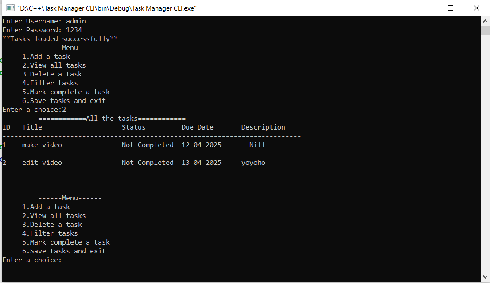

📋 Task Manager CLI Application
A simple and effective Task Manager built in C++ for the terminal. This command-line tool lets you manage daily tasks with features like authentication, task filtering, marking completion, and file-based persistence.

🚀 Features
🔐 Username & Password Authentication
📌 Add, View, Delete Tasks
✅ Mark Tasks as Completed
🔍 Filter Tasks by Status
💾 Save/Load Tasks to CSV file
🧾 Improved Display Formatting for Task View

📁 project-directory/
│
├── credentials.txt     // Stores username,password (e.g., admin,1234)
├── Tasks.csv           // Stores all tasks
├── main.cpp            // Source code
└── README.md
└── [task-manager-cli.png] // Screenshot of output terminal

## 📸 Screenshot

💡 Learning Goals
Practiced manual file I/O with CSV

Built a basic authentication system

Improved terminal output formatting

Developed a complete CLI workflow in C++

📜 License
This project is open-source and free to use under the MIT License.
